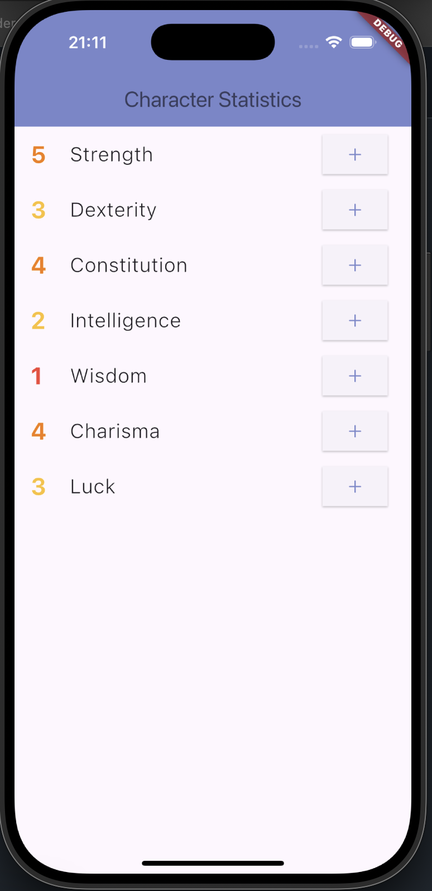

# 📊 Character Statistics App

A simple mobile application for managing character statistics, built with Flutter. Users can view and increment different attributes such as Strength, Dexterity, Constitution, Intelligence, Wisdom, Charisma, and Luck.

## ✨ Features

- Displays character statistics with numerical values.
- Color-coded numbers for easy readability.
- Incremental buttons to increase each statistic.
- Clean and intuitive UI.

## 🚀 Technologies Used

- **Flutter**: Cross-platform development.
- **Dart**: Programming language for Flutter.

## 📷 Screenshots

  
_Example of the app displaying character stats with an increment button._

## 🔧 Installation

1. Clone the repository:
   ```bash
   git clone https://github.com/your-username/character-statistics.git
   cd character-statistics
   ```
2. Install dependencies:
   ```bash
   flutter pub get
   ```
3. Run the app:
   ```bash
   flutter run
   ```

## 🛠️ TODO

- Add decrement buttons.
- Implement persistent storage.
- Enhance UI with animations.
